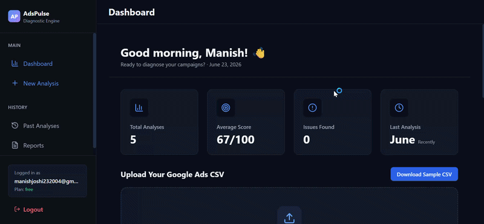
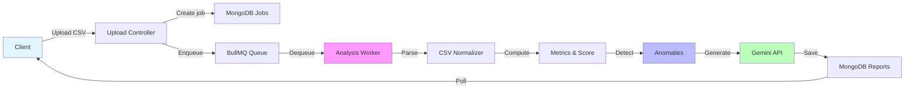

# AdsPulse

**Statistical diagnostics and AI-powered optimization engine for Google Ads campaigns.**



---

## Why This Exists

Google Ads CSVs are powerful but dense. Advertisers download campaign performance data hoping to understand what's working—instead they get 50+ columns, inconsistent naming across regions, and no insight into *why* performance changed week-to-week. AdsPulse solves this by ingesting the CSV, automatically normalizing column aliases, computing account-level metrics, detecting anomalies via statistical methods (mean/stddev), and generating ranked optimization recommendations via Gemini when enabled. It turns raw data into actionable diagnostics in <60 seconds.

---

## Architecture



**Data flow**: Upload → Validate & Rate Limit → Create job doc in MongoDB → Enqueue to Redis-backed BullMQ → Worker picks up at concurrency=2 → Parse CSV (alias normalization) → Compute account-level metrics & performance score → Detect anomalies via z-score (current vs. previous week) → Call Gemini API (10 req/min limit, gracefully degrades if key missing) → Save report to MongoDB → Client polls with exponential backoff (2s → 10s, max 10 retries)

---

## Key Technical Features

- **CSV Column Alias Resolution** — Handles 50+ column aliases (e.g., `costGBP`, `spend`, `cost`; `convvalue`, `conversionValue`) via canonical string mapping in [src/services/csvParser.service.js](server/src/services/csvParser.service.js#L14-L35). Different Google Ads accounts export different column names; this normalizes them before metric computation.

- **Asynchronous Job Queue with Backpressure** — Uses BullMQ (Redis-backed) with exponential backoff (2s, 4s, 8s) and concurrency=2 in [src/workers/analysis.worker.js](server/src/workers/analysis.worker.js#L11). Decouples expensive CSV parsing and AI generation from the upload request, enabling fast client feedback and server stability under load.

- **Statistical Anomaly Detection** — Compares current week vs. previous week for 6 key metrics (clicks, impressions, cost, CTR, conversion rate, ROAS) using z-score over standard deviation in [src/services/diagnostics.service.js](server/src/services/diagnostics.service.js#L544-L600). Flags changes >1.96σ as anomalies, protecting against false positives from random noise.

- **Gemini API with Custom Rate Limiter** — Respects 10 API calls/minute quota internally (tracked in memory) in [src/services/gemini.service.js](server/src/services/gemini.service.js#L5-L55). Retries failed requests with 2s exponential backoff before surfacing errors. Gracefully degrades if `GEMINI_API_KEY` is not set.

- **Client-Side Polling with Exponential Backoff** — Frontend polls job status starting at 2s intervals, doubling up to 10s max, with 10 retries in [client/src/hooks/useAnalysisPoller.js](client/src/hooks/useAnalysisPoller.js#L20-L50). Avoids WebSocket complexity while still providing near-real-time UX for most users.

- **Multi-Layer Rate Limiting** — Separate rate limits per endpoint: 10 uploads/hour, 50 analysis checks/min, 5 auth attempts/15min in [src/middleware/rateLimit.middleware.js](server/src/middleware/rateLimit.middleware.js). Prevents abuse and API quota exhaustion.

- **Structured Error Handling with HTTP Semantics** — Custom error categorization (VALIDATION_ERROR, DATABASE_REQUIRED, QUEUE_UNAVAILABLE, etc.) mapped to proper HTTP status codes (400, 503, 413, 409) in [src/middleware/errorHandler.middleware.js](server/src/middleware/errorHandler.middleware.js). Clients can retry or fail fast based on the error code.

---

## Tech Stack

| Layer | Tech | Why |
|-------|------|-----|
| **Frontend** | React 18 + Vite | Fast builds (HMR), optimized output; React Query handles job polling state |
| **Styling** | Tailwind CSS | Rapid iteration on responsive design; charts + animations with Recharts/Framer Motion |
| **API** | Express 5.1 | Minimal overhead; supports middleware pipeline for auth, validation, rate limiting |
| **Job Queue** | BullMQ + Redis | Decouples analysis work; handles retries, stalling, and job state atomically |
| **Database** | MongoDB + Mongoose | Flexible schema for job progress tracking and report storage; aggregations for analytics |
| **AI** | Gemini 1.5 Flash | Fast, lower-cost LLM; structured prompts for consistent recommendation categories (bidding, keywords, budget, targeting, etc.) |
| **Security** | Helmet + CORS | CSP headers prevent XSS; explicit origin whitelist for CORS |
| **CSV Parsing** | csv-parse (streaming) | Handles large files without memory overflow; row-by-row normalization |

---

## Setup & Usage

### Prerequisites
- Node.js 20+
- MongoDB instance (local or Atlas)
- Redis instance (local or Upstash)
- Optional: `GEMINI_API_KEY` from Google AI Studio

### Local Development

```bash
# Install backend
cd server
npm install

# Install frontend
cd ../client
npm install

# Copy environment template
cd ../
cp .env.example server/.env
# Edit server/.env with your MongoDB and Redis URLs

# Start backend (port 5000)
cd server
npm run dev

# In another terminal, start frontend (port 5173)
cd client
npm run dev

# Open http://localhost:5173
```

### Run Tests

```bash
cd server
npm test                # Single run
npm run test:watch     # Watch mode
npm run test:coverage  # Coverage report
```

### Production Build

```bash
# Frontend
cd client
npm run build
# Output: dist/

# Backend
cd server
NODE_ENV=production npm start
```

---

## Performance Considerations

**Job Concurrency**: Worker processes up to 2 analysis jobs concurrently, batching large CSV ingests to avoid memory spikes. Each job updates progress every 10–15% to keep UX responsive.

**Gemini Quota Protection**: In-memory timestamp tracking limits Gemini to 10 calls/min. If quota is hit, recommendations degrade gracefully (client still receives structured diagnostics).

**CSV Parsing**: Uses streaming parser to avoid loading entire file into memory upfront. Row-level normalization ensures consistent metric aggregations.

**MongoDB Cleanup**: Hourly task removes uploaded CSV files older than 24 hours to manage server disk.

---

## What's Next

1. **Real-Time Job Status via WebSocket** — Replace polling with `ws` to reduce latency perception for large CSV analysis and enable push notifications.

2. **Caching Layer for Benchmark Data** — Cache `BENCHMARKS` (CTR, CPC, ROAS by network type) and diagnostics thresholds in Redis. Currently hardcoded in memory; external config allows A/B testing different thresholds per account segment.

3. **Batch Report Scheduling** — Add cron job support for recurring CSV uploads (e.g., "analyze our ads every Monday"). Requires auth enhancements and subscription tiers.

---

## License

MIT

The frontend proxies `/api` requests to `http://localhost:5000`. If MongoDB is not configured in development, the API uses in-memory report/user storage for synchronous reports. `REDIS_URL` must be set to an Upstash Redis `rediss://` endpoint because the BullMQ worker starts with the API.

## Environment Variables

Create `server/.env` from `.env.example`.

| Variable | Required | Description |
| --- | --- | --- |
| `GEMINI_API_KEY` | Optional locally | Gemini API key used for AI recommendations. If omitted, deterministic recommendations are generated from diagnostic rules. |
| `MONGODB_URI` | Required in production | MongoDB Atlas connection string for users and reports. |
| `REDIS_URL` | Required in production | Upstash Redis `rediss://` endpoint used by BullMQ/ioredis for async analysis jobs. |
| `PORT` | Yes | Express server port. Defaults to `5000`. |
| `NODE_ENV` | Yes | `development`, `test`, or `production`. |
| `CLIENT_URL` | Yes | Allowed CORS origin for the frontend, such as `http://localhost:5173` or the Vercel URL. |
| `JWT_SECRET` | Required in production | Long random secret for signing auth tokens. |

## API Overview

- `GET /api/health` returns service status.
- `POST /api/auth/register` creates a user account.
- `POST /api/auth/login` returns a JWT.
- `GET /api/auth/me` returns the authenticated user.
- `POST /api/upload` accepts a `file` multipart CSV upload and returns a completed report.
- `POST /api/upload?async=true` queues analysis through BullMQ using the Upstash Redis `REDIS_URL`.
- `GET /api/upload/jobs/:jobId` returns async analysis job status.
- `GET /api/analysis` lists analysis reports.
- `GET /api/analysis/latest` returns the newest report.
- `GET /api/analysis/:id` returns one report.
- `GET /api/reports` lists reports.
- `GET /api/reports/summary` returns report history totals.
- `GET /api/reports/:id` returns one report.
- `DELETE /api/reports/:id` deletes one report.

## CSV Expectations

AdsPulse accepts standard Google Ads CSV exports with campaign performance columns. The parser supports common header variants including `Campaign`, `Date` or `Day`, `Impr.` or `Impressions`, `Clicks`, `Cost`, `Conversions`, `CTR`, `Avg. CPC`, `Conv. rate`, and `Cost / conv.`. Metadata rows before the header are skipped automatically.

A sample CSV is available at `client/public/sample-google-ads.csv`.

## Deployment Guide

### MongoDB Atlas

1. Create a MongoDB Atlas cluster.
2. Create a database user with read/write permissions.
3. Add the Render outbound IPs or allow access from `0.0.0.0/0` if your security policy permits it.
4. Copy the connection string into `MONGODB_URI`.

### Upstash Redis

1. Create an Upstash Redis database.
2. Copy the Redis `rediss://` endpoint into `REDIS_URL`.
3. Do not expose `REDIS_URL` to the Vercel frontend. It belongs only in the Render backend environment.

### Render Backend

1. Create a new Render Web Service from this repository.
2. Set the root directory to `server`.
3. Set the build command to `npm install`.
4. Set the start command to `npm start`.
5. Add environment variables from `.env.example`.
6. Set `NODE_ENV=production`.
7. Set `CLIENT_URL` to the final Vercel frontend URL.
8. Deploy and confirm `https://your-render-service.onrender.com/api/health` returns `status: ok`.

### Vercel Frontend

1. Create a new Vercel project from this repository.
2. Set the root directory to `client`.
3. Use `npm run build` as the build command.
4. Use `dist` as the output directory.
5. Add a rewrite so `/api/:path*` forwards to the Render backend, or set a Vercel project proxy to the backend URL.
6. Deploy and test CSV upload from the Vercel URL.

For Vercel rewrites, add this to `client/vercel.json` if you prefer repository-managed routing:

```json
{
  "rewrites": [
    {
      "source": "/api/:path*",
      "destination": "https://your-render-service.onrender.com/api/:path*"
    }
  ]
}
```

## Production Notes

- Keep `server/uploads` ephemeral. Uploaded CSVs are removed after synchronous analysis and after async worker completion.
- Use a long random `JWT_SECRET`.
- Restrict `CLIENT_URL` to the exact deployed frontend origin.
- Keep Gemini failures non-blocking; the backend falls back to rule-based recommendations.
- Monitor Render logs for async job failures and Gemini quota errors.
